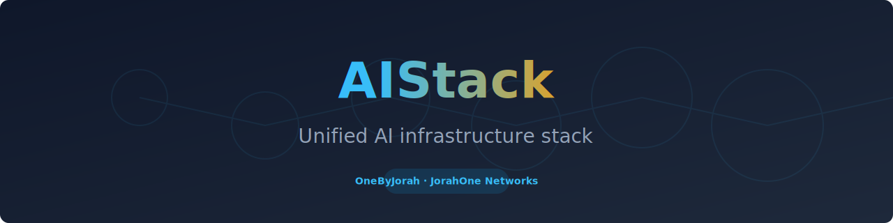
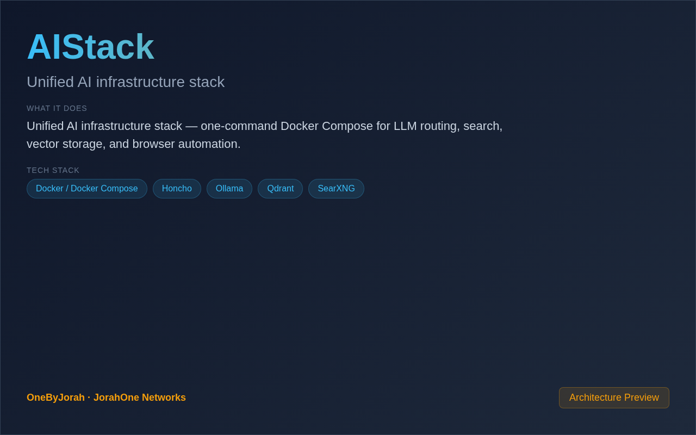

<div align="center">



# AIStack

Unified AI infrastructure stack


</div>

---

<p align="center">
  
</p>

<br>

---

## Features

- **One-Command Deploy** — `docker compose up -d` and you're ready.
- **LLM Routing** — Route requests to multiple local/remote LLMs.
- **Vector Storage** — Qdrant for embeddings and semantic search.
- **Web Search** — SearXNG for private web search.
- **Browser Automation** — Headless browser for web interaction.
- **Privacy-Focused** — All data stays on your infrastructure.
- **CPU-Only** — No GPU required.
- **Production Ready** — Health checks, monitoring, and logging.

## Quick Start

```bash
git clone https://github.com/OneByJorah/AIStack.git
cd AIStack

cp .env.example .env
docker compose up -d
```

### Access Services

| Service | URL |
|---------|-----|
| Ollama | http://localhost:11434 |
| Qdrant | http://localhost:6333 |
| SearXNG | http://localhost:8080 |
| Browser | http://localhost:9222 |

## Stack Components

| Component | Purpose |
|-----------|---------|
| **Ollama** | Local LLM hosting |
| **Qdrant** | Vector database |
| **SearXNG** | Privacy web search |
| **Playwright** | Browser automation |
| **Redis** | Caching and queues |
| **PostgreSQL** | Relational data |

## Configuration

| Variable | Default | Description |
|----------|---------|-------------|
| `OLLAMA_MODELS` | `llama2,mistral` | Models to download |
| `QDRANT_PORT` | `6333` | Qdrant API port |
| `SEARXNG_PORT` | `8080` | SearXNG port |
| `POSTGRES_DB` | `aistack` | Database name |

## Project Structure

```
AIStack/
├── docker-compose.yml     # Main compose file
├── .env.example           # Environment template
├── ollama/
│   └── Modelfile          # Custom model configs
├── qdrant/
│   └── config.yaml
├── scripts/
│   ├── setup.sh           # Initial setup
│   └── health-check.sh
└── README.md
```

## Contributing

Contributions are welcome. Please see [CONTRIBUTING.md](CONTRIBUTING.md) for guidelines and [CODE_OF_CONDUCT.md](CODE_OF_CONDUCT.md) for community standards.

## Security

For security concerns, see [SECURITY.md](SECURITY.md). Please report vulnerabilities to **info@jorahone.com** — do not use public issues.

## License

MIT © Jhonattan L. Jimenez

---

## 🤝 Contributing

See [CONTRIBUTING.md](CONTRIBUTING.md). All contributions follow the [Code of Conduct](CODE_OF_CONDUCT.md).

## 🔒 Security

Found a vulnerability? Please follow our [Security Policy](SECURITY.md) and report privately to `security@jorahone.com`.

## 📄 License

[MIT License](LICENSE) © Jhonattan L. Jimenez (OneByJorah)

---

<p align="center">Built with 🌴 by <a href="https://github.com/OneByJorah">OneByJorah</a> · <a href="https://jorahone.com">jorahone.com</a></p>
